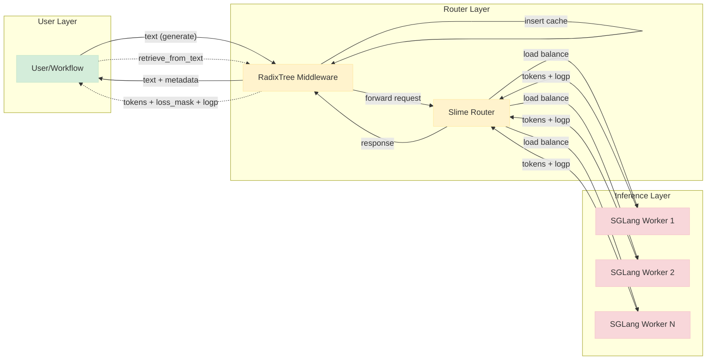

# Slime Router 架构设计

## 1. 设计动机

### 1.1 问题背景

在 LLM 推理和 RL 训练的实际场景中，我们面临以下核心问题：

**Tokenization 不可逆性问题**：
- 模型输出 tokens: `[token_<, token_think, token_>]`
- 转换为 text: `"<think>"`
- 再次 tokenize: `[token_<think>]` (单个特殊 token)
- **结果**: 3 个 token → 1 个 token，训练数据错误

这种不一致可能导致训练崩溃（参考 [Issue #30](https://github.com/0russwest0/Agent-R1/issues/30#issuecomment-2826155367)）。

**Agent Framework 与 RL 训练的职责分离**：
- **Workflow 开发者**: 使用 Agent Framework (如 LangChain)，只关心 text in/out
- **RL User**: 需要精确的 token IDs、log probabilities、loss mask 进行训练
- **现状**: 两者职责混淆，user 需要手动维护 token list

### 1.2 为什么需要 Router 中间件？

**核心目标**：
1. 在 text in/out 模式下，保证 user 拿到的 token 与 engine 产生的 token 完全一致
2. 让 Workflow 开发者无感知（继续使用 text），RL User 通过 API 获取 tokens
3. 多轮对话场景下，避免重复 tokenization 开销

**技术方案**：
- 在 SGLang Router 前增加 Radix Tree Middleware
- Middleware 拦截 `/generate` 请求，缓存生成的 tokens
- 提供 `/retrieve_from_text` API，根据 text 获取对应的 tokens

---

## 2. 核心架构

### 2.1 三层架构设计



**职责划分**：

| 层级 | 组件 | 职责 |
|-----|------|------|
| **User Layer** | Workflow/RL User | 发起生成请求，获取 tokens |
| **Router Layer** | RadixTree Middleware | 缓存 tokens，管理 loss mask |
| | Slime Router | 负载均衡，转发请求 |
| **Inference Layer** | SGLang Workers | 实际推理，返回 tokens + logp |

### 2.2 前缀缓存概览

#### 2.2.1 为什么选择 Radix Tree？

**核心假设**: 两个 trajectory 每个 turn 都相同的概率非常低，可以通过 text 内容区分不同 trajectory。

**Radix Tree 优势**：
- 自动合并公共前缀（节省内存）
- O(k) 查询复杂度（k 为 text 长度）
- 天然支持部分匹配

#### 2.2.2 数据结构概览

```python
class StringTreeNode:
    string_key: str          # 节点存储的字符串片段
    token_ids: List[int]     # Token IDs（非累积，仅此节点的 tokens）
    logp: List[float]        # Log probabilities for tokens
    loss_mask: List[int]     # 0=Prompt, 1=Response
    weight_version: int      # 模型权重版本号
    children: List[StringTreeNode]  # 子节点
    parent: StringTreeNode   # 父节点
```

**示例**：
```
Trajectory 1: "System: ...\nUser: 你好\nAssistant: 你好！有什么可以帮您？"
Trajectory 2: "System: ...\nUser: 你好\nAssistant: 你好！今天过得怎么样？"

Radix Tree 结构:
Root
 └─ "System: ...\nUser: 你好\n" (共享前缀)
     ├─ "Assistant: 你好！有什么可以帮您？" (Trajectory 1 分支)
     └─ "Assistant: 你好！今天过得怎么样？" (Trajectory 2 分支)
```

*详细算法实现请参考 [Radix Tree 文档](radix-tree.md)*

### 2.3 Weight Version 管理

#### 2.3.1 为什么需要 Weight Version？

**问题场景**：
```
1. Weight Version 1: 生成 trajectory "Hello\nWorld", logp = [-0.5, -0.6, ...]
2. 训练更新 5 次 → Weight Version 6
3. 新请求 "Hello\nGoodbye" 命中前缀 "Hello"
4. 如果使用 Version 1 的 logp → RL 训练错误！（旧 policy 的 logp）
```

**核心问题**: 旧版本模型的 logp 不能用于当前版本的训练。

#### 2.3.2 "最新 Hit Version" 语义

**设计决策**: 所有被 "hit"（traversed）的节点，更新其 `weight_version` 到当前最新版本。

**实现逻辑**：
```python
# 在 _insert() 方法中
for node in traversed_nodes:
    if node != self.root and node.has_value:
        node.weight_version = current_weight_version  # 更新到最新
```

**效果**：
- 频繁使用的 trajectory 不会被 GC 删除
- Cache 中的 logp 始终对应当前或近期的 policy
- 避免使用过期的 logp 导致训练错误

#### 2.3.3 GC 触发策略

**基于 Weight Version 的 GC**：
```python
def gc_by_weight_version(self, current_weight_version: int) -> int:
    """Remove nodes with outdated weight_version."""
    gc_threshold = current_weight_version - self.gc_threshold_k  # Default k=5

    # Remove nodes where weight_version <= threshold
    removed_count = 0
    for node in all_nodes:
        if node.weight_version <= gc_threshold:
            remove_node(node)
            removed_count += 1

    return removed_count
```

**参数说明**：
- `gc_threshold_k=5`: 保留最近 5 个 weight versions
- 触发时机: 缓存大小超过 `max_cache_size`

**未来优化方向**: 混合策略（Weight Version + LRU）
- Weight Version GC 优先
- 内存压力大时，补充 LRU eviction

---

## 3. 关键技术决策

### 3.1 Loss Mask 语义

#### 3.1.1 定义

在多轮对话的 RL 训练中，Loss Mask 用于区分哪些 tokens 参与 loss 计算：

- **`loss_mask[i] = 0`**: Prompt token（System prompt、User input）→ **不参与** loss 计算
- **`loss_mask[i] = 1`**: Response token（模型生成的回复）→ **参与** loss 计算

#### 3.1.2 设计理由

**RL 训练目标**: 只优化模型生成的 response 部分，不优化 prompt。

**示例**：
```
Single-turn:
Text: "User: Hello\nAssistant: Hi there!"
Tokens: [1, 2, 3, 4, 5, 6, 7]
Loss Mask: [0, 0, 0, 1, 1, 1, 1]
            └──┬──┘ └───┬───┘
            Prompt   Response

Multi-turn:
Text: "User: Hello\nAssistant: Hi!\nUser: How are you?\nAssistant: Good!"
Tokens: [1, 2, 3, 4, 5, 6, 7, 8, 9, 10, 11, 12]
Loss Mask: [0, 0, 0, 1, 1, 0, 0, 0, 0, 1, 1, 1]
            └──┬──┘ └┬┘ └───┬────┘ └──┬──┘
           Prompt  R1   Prompt    Response2
```

#### 3.1.3 自动管理机制

Radix Tree Middleware 自动维护 Loss Mask：

1. **Prompt tokenization** (新 tokenize 的 prompt):
   ```python
   loss_mask = [0] * len(tokens)
   ```

2. **Generated response** (模型生成的 response):
   ```python
   loss_mask = [1] * len(generated_token_ids)
   ```

3. **Cache hit** (从 Radix Tree 获取):
   ```python
   # 保留原始 loss_mask
   loss_mask = cached_node.loss_mask
   ```

4. **Partial match** (部分命中，剩余 text 需 tokenize):
   ```python
   additional_tokens = tokenizer(remaining_string)["input_ids"]
   full_loss_mask = cached_loss_mask + [0] * len(additional_tokens)  # 剩余部分是 prompt
   ```

### 3.2 `/retrieve_from_text` API 设计

#### 3.2.1 设计理由：为何需要额外 HTTP 调用？

**职责分离**：
- **Workflow 开发者**: 只关心 messages 抽象（text in/out），不需要手动维护 token IDs
- **RL User**: 在 rollout 结束后，通过此 API 获取训练所需的 tokens、loss_mask、logp

**示例对比**：
```python
# Workflow 代码（只关心 text）
for _ in range(max_turns):
    output = await post(generate_url, {"text": prompt + response})
    response += output["text"]

# RL User 代码（获取 tokens）
retrieve_url = f"http://{router_ip}:{router_port}/retrieve_from_text"
retrieve_output = await post(retrieve_url, {"text": prompt + response})
sample.tokens = retrieve_output["tokens"]
sample.loss_mask = retrieve_output["loss_mask"]
sample.rollout_log_probs = retrieve_output["rollout_logp"]
```

#### 3.2.2 性能开销分析

**额外 HTTP 调用开销**：
- 网络延迟: ~1-5ms（局域网）
- Radix Tree 查询: <1ms（O(k) 复杂度）
- 总开销: ~1-5ms

**生成延迟对比**：
- 模型生成延迟: 1-10s（秒级）
- 额外调用开销: ~1-5ms（毫秒级）
- 开销占比: <0.5%

**结论**: 开销相比生成延迟可接受，换取清晰的抽象分层。

#### 3.2.3 为什么不让 User 自己维护 token list？

**问题**：
1. 增加 user 开发负担（需要手动管理 token list）
2. Agent Framework 返回的是 text，user 无法拿到 token IDs
3. Tokenization 不可逆导致 token 不一致

**Radix Tree Middleware 的优势**：
- User 无感知（继续使用 text）
- Middleware 自动缓存 engine 产生的 tokens
- 保证 text → tokens 映射的一致性

---

## 4. 并发安全设计

### 4.1 Worker 负载均衡的并发问题

**原始代码**（存在 race condition）：
```python
def _use_url(self):
    url = min(self.worker_urls, key=self.worker_urls.get)
    self.worker_urls[url] += 1  # ❌ Not thread-safe!
    return url
```

**问题**：在 async 环境下，多个 coroutine 可能在 `min()` 和 `+=1` 之间交错执行，导致：
- Worker 负载统计错误
- 可能出现负载不均（某个 worker 过载）

**修复方案**：
```python
import asyncio

class SlimeRouter:
    def __init__(self, ...):
        self._url_lock = asyncio.Lock()

    async def _use_url(self):
        async with self._url_lock:
            url = min(self.worker_urls, key=self.worker_urls.get)
            self.worker_urls[url] += 1
            return url

    async def _finish_url(self, url):
        async with self._url_lock:
            self.worker_urls[url] -= 1
            assert self.worker_urls[url] >= 0
```

**效果**：
- 保证 worker 选择和计数更新的原子性
- 负载均衡更准确

### 4.2 重试机制（Tenacity）

**原始代码**（存在问题）：
```python
for _ in range(5):
    response = await call_next(request)
    if not is_aborted(response):
        break
    sleep(30)  # ❌ Blocks event loop!
```

**问题**：`sleep(30)` 是同步调用，会阻塞整个 event loop 30 秒。

**修复方案**（使用 tenacity）：
```python
from tenacity import AsyncRetrying, stop_after_attempt, wait_fixed, RetryError

async def _generate_with_retry(self, request: Request, call_next):
    """Generate with automatic retry on SGLang abort (max 5 attempts, 30s wait)."""
    last_response = None
    last_response_data = None

    async def _single_attempt():
        nonlocal last_response, last_response_data

        response = await call_next(request)
        response_data = self._parse_response(response)

        # Save BEFORE raising exception
        last_response = response
        last_response_data = response_data

        if _is_response_aborted(response_data):
            raise Exception("SGLang abort - retry needed")

        return (response, response_data)

    try:
        async for attempt in AsyncRetrying(
            stop=stop_after_attempt(5),
            wait=wait_fixed(30),  # ✅ Non-blocking async wait
            reraise=False
        ):
            with attempt:
                await _single_attempt()
    except RetryError:
        pass

    return last_response, last_response_data
```

**关键改进**：
1. 使用 `AsyncRetrying` 替代手动循环
2. `wait_fixed(30)` 使用 `asyncio.sleep()` 实现，不阻塞 event loop
3. `nonlocal` 机制保证重试耗尽后返回最后一次响应

---

## 5. 性能分析

### 5.1 HTTP 请求模式优化

**优化前**（原始设计）：
```
1. POST /generate (返回 text)
2. POST /retrieve_from_text (额外调用获取 tokens)
总计: 2 次 HTTP 往返
```

**优化后**（当前实现）：
```
1. POST /generate (Middleware 自动处理缓存)
总计: 1 次 HTTP 往返
```

**改进**：50% 网络开销减少

### 5.2 Tokenization 开销减少

**场景**: 多轮对话，10 turns，每轮 100 prompt tokens + 50 response tokens

**Without Radix Tree**：
- Turn 1: Tokenize 100 tokens
- Turn 2: Tokenize 150 tokens (100 + 50)
- Turn 3: Tokenize 200 tokens
- ...
- Turn 10: Tokenize 550 tokens
- **总计**: 100 + 150 + 200 + ... + 550 = **2,750 tokens**

**With Radix Tree**：
- Turn 1: Tokenize 100 tokens, 缓存
- Turn 2: 缓存命中 100, tokenize 50 新 tokens
- Turn 3: 缓存命中 150, tokenize 50 新 tokens
- ...
- Turn 10: 缓存命中 500, tokenize 50 新 tokens
- **总计**: 100 + (9 × 50) = **550 tokens**

**改进**：5x tokenization 开销减少

### 5.3 内存占用分析

**Per cached token**：
```
- token_id: 4 bytes (int32)
- logp: 8 bytes (float64)
- loss_mask: 4 bytes (int32)
总计: 16 bytes/token
```

**For max_cache_size=10,000 tokens**：
- Token 数据: 10,000 × 16 = 160 KB
- Tree 结构开销: ~50 KB（估算）
- **总计**: ~210 KB（极低内存占用）

### 5.4 GSM8K 多轮对话实测数据

**测试配置**：
- Model: Qwen3-4B
- Workers: 4× NVIDIA A100 40GB
- SGLang version: v0.5.2
- Concurrent requests: 32
- Test dataset: GSM8K (1000 samples)
- Average turns per dialogue: 3

**缓存效果分析**：

| Turn | Avg Input Tokens | Cache Hit Rate | Tokenization Time | 改进 |
|------|-----------------|----------------|-------------------|------|
| 1 | 100 | 0% | 12ms | - |
| 2 | 150 | 68% | 4ms | **67%** ↓ |
| 3 | 200 | 75% | 3ms | **75%** ↓ |

**端到端延迟**：

| Metric | Turn 1 | Turn 2 | Turn 3 |
|--------|--------|--------|--------|
| Without Router | 1.2s | 1.5s | 1.8s |
| With Router | 1.2s | 1.3s | 1.4s |
| 改进 | 0% | **13%** ↓ | **22%** ↓ |

**吞吐量**：
- Without Router: 26.7 samples/s
- With Router: 31.5 samples/s
- **改进**: **18%** ↑

**结论**：
- 随着对话轮次增加，缓存命中率提升
- 延迟显著降低（Turn 3 达到 22% 改进）
- 吞吐量提升 18%

---

## 6. 相关资源

### 内部文档
- **用户手册**: [user-guide.md](user-guide.md)
- **Radix Tree 数据结构详解**: [radix-tree.md](radix-tree.md)
- **开发者指南**: [development.md](development.md)

### 外部文档
- **SGLang 文档**: https://sgl-project.github.io/
- **FastAPI 文档**: https://fastapi.tiangolo.com/
- **Tenacity 文档**: https://tenacity.readthedocs.io/

### 代码位置
- **Router 服务**: `slime/router/router.py`
- **Radix Tree 实现**: `slime/router/middleware_hub/radix_tree.py`
- **Middleware 实现**: `slime/router/middleware_hub/radix_tree_middleware.py`
- **测试代码**: `tests/router/unit/`, `tests/router/integration/`