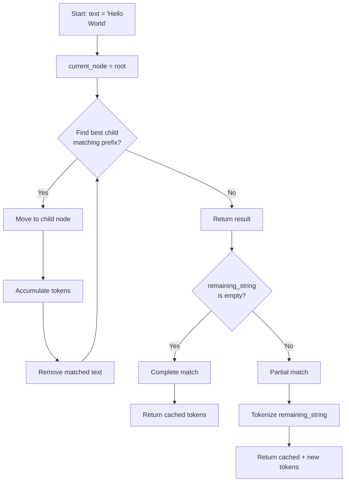

# Radix Tree 数据结构详解

## 1. StringTreeNode 字段说明

### 1.1 核心字段

```python
class StringTreeNode:
    """Radix Tree node for storing dialogue trajectory tokens."""

    # String key
    string_key: str = ""  # 节点存储的字符串片段（非累积）

    # Token data (non-cumulative, only for this node's fragment)
    token_ids: List[int] = field(default_factory=list)  # Token IDs
    logp: List[float] = field(default_factory=list)     # Log probabilities
    loss_mask: List[int] = field(default_factory=list)  # 0=Prompt, 1=Response

    # Tree structure
    children: List["StringTreeNode"] = field(default_factory=list)
    parent: Optional["StringTreeNode"] = None

    # Cache management
    weight_version: int = 0      # 模型权重版本号（用于 GC）
    last_access_time: int = 0    # 最后访问时间（LRU 备用）
    ref_count: int = 0           # 引用计数（防止过早删除）
```

### 1.2 字段语义详解

#### `string_key`
- **作用**: 存储从父节点到当前节点的字符串片段
- **非累积性**: 只存储增量部分，不包含父节点的内容
- **示例**:
  ```
  Root
   └─ Node1 (string_key="Hello\n")
       └─ Node2 (string_key="World")

  完整路径: "Hello\nWorld"
  Node2.string_key 仅为 "World"
  ```

#### `token_ids`, `logp`, `loss_mask`
- **作用**: 存储 `string_key` 对应的 tokenization 结果
- **非累积性**: 只存储当前节点的 tokens，查询时需沿路径累积
- **一致性保证**: `len(token_ids) == len(logp) == len(loss_mask)`
- **示例**:
  ```python
  node.string_key = "Hello"
  node.token_ids = [12, 34, 56]
  node.logp = [-0.1, -0.2, -0.3]
  node.loss_mask = [0, 0, 0]  # Prompt tokens
  ```

#### `weight_version`
- **作用**: 标记此节点的 tokens/logp 对应的模型版本
- **更新时机**:
  1. 节点创建时，设置为当前 `current_weight_version`
  2. 节点被 traversed（命中）时，更新到最新版本
- **GC 依据**: `weight_version <= (current_version - gc_threshold_k)` 的节点会被删除
- **示例**:
  ```python
  # Weight version 1: 创建节点
  node.weight_version = 1

  # Weight version 5: 节点被 traversed
  node.weight_version = 5  # 更新到最新

  # Weight version 10, gc_threshold_k=5: GC 触发
  # 删除 weight_version <= 5 的节点
  ```

#### `ref_count`
- **作用**: 防止正在使用的节点被 GC 删除
- **更新时机**: 查询时 +1，查询结束 -1
- **未来优化**: 当前版本未使用，预留字段

---

## 2. 核心算法实现

### 2.1 非累积 Token 存储

#### 2.1.1 设计理由

**为什么不存储累积 tokens？**

**方案 A**（累积存储，❌ 不采用）：
```python
# 每个节点存储从 root 到当前节点的所有 tokens
node1.token_ids = [1, 2, 3]
node2.token_ids = [1, 2, 3, 4, 5]  # 包含 node1 的 tokens
```

**问题**：
- 内存浪费严重（重复存储前缀 tokens）
- 更新困难（父节点变化时，所有子节点需重新计算）

**方案 B**（非累积存储，✅ 采用）：
```python
# 每个节点只存储增量 tokens
node1.token_ids = [1, 2, 3]
node2.token_ids = [4, 5]  # 仅新增部分
```

**优势**：
- 内存高效（共享前缀）
- 更新简单（局部修改）

#### 2.1.2 查询时的 Token 累积

**实现**：
```python
def find_longest_prefix(self, text: str) -> RadixTreeResult:
    """Find longest matching prefix and accumulate tokens along the path."""
    current_node = self.root
    matched_tokens = []
    matched_logp = []
    matched_loss_mask = []

    remaining_text = text

    while remaining_text:
        best_child = self._find_best_child(current_node, remaining_text)
        if best_child is None:
            break

        current_node = best_child
        remaining_text = remaining_text[len(best_child.string_key):]

        # Accumulate tokens from this node
        if best_child.has_value:
            matched_tokens.extend(best_child.token_ids)  # 累积
            matched_logp.extend(best_child.logp)
            matched_loss_mask.extend(best_child.loss_mask)

    return RadixTreeResult(
        token_ids=matched_tokens,
        logp=matched_logp,
        loss_mask=matched_loss_mask,
        remaining_string=remaining_text
    )
```

### 2.2 查询算法：find_longest_prefix()

#### 2.2.1 算法流程



#### 2.2.2 核心逻辑

**1. 部分匹配的处理**：

```python
result = radix_tree.find_longest_prefix("Hello\nWorld\nNew")

# 假设缓存中只有 "Hello\nWorld"
result.matched_prefix = "Hello\nWorld"
result.token_ids = [1, 2, 3, 4, 5]
result.remaining_string = "\nNew"  # 未匹配部分
```

**处理方式**：
```python
if result.remaining_string:
    # Tokenize remaining text
    additional_tokens = tokenizer(result.remaining_string)["input_ids"]
    full_token_ids = result.token_ids + additional_tokens
    full_loss_mask = result.loss_mask + [0] * len(additional_tokens)  # Prompt
```

**2. Loss Mask 的正确生成**：

**关键修复**（PR #418 中修复的 bug）：
```python
# ❌ BEFORE (错误实现)
if result.remaining_string:
    additional_tokens = tokenizer(result.remaining_string)["input_ids"]
    full_loss_mask = result.loss_mask + [1] * len(additional_tokens)  # ❌ 错误！

# ✅ AFTER (正确实现)
if result.remaining_string:
    additional_tokens = tokenizer(result.remaining_string)["input_ids"]
    full_loss_mask = result.loss_mask + [0] * len(additional_tokens)  # ✅ Prompt tokens
```

**理由**: 剩余的 `remaining_string` 是用户输入的新 prompt，不是模型生成的 response，应该标记为 `loss_mask=0`。

### 2.3 插入算法：_insert()

#### 2.3.1 算法流程

```python
def _insert(
    self,
    text: str,
    token_ids: List[int],
    logp: List[float],
    loss_mask: List[int],
    weight_version: Optional[int] = None,
) -> bool:
    """Insert new trajectory or extend existing one."""
    current_node = self.root
    remaining_text = text
    remaining_tokens = token_ids[:]
    remaining_logp = logp[:]
    remaining_loss_mask = loss_mask[:]

    # Track ALL traversed nodes (not just new ones)
    traversed_nodes = [current_node]
    new_node = None

    while remaining_text:
        best_child = self._find_best_child(current_node, remaining_text)

        if best_child is not None:
            # Found existing node, traverse
            current_node = best_child
            traversed_nodes.append(current_node)  # ✅ Track traversed

            remaining_text = remaining_text[len(best_child.string_key):]

            if best_child.has_value:
                # Skip tokens already stored in this node
                tokens_to_skip = len(best_child.token_ids)
                remaining_tokens = remaining_tokens[tokens_to_skip:]
                remaining_logp = remaining_logp[tokens_to_skip:]
                remaining_loss_mask = remaining_loss_mask[tokens_to_skip:]
        else:
            # Create new node
            new_node = StringTreeNode(
                string_key=remaining_text,
                token_ids=remaining_tokens,
                logp=remaining_logp,
                loss_mask=remaining_loss_mask,
                parent=current_node
            )
            current_node.children.append(new_node)
            traversed_nodes.append(new_node)
            self.total_entries += 1
            self.cur_cache_size += len(remaining_tokens)
            break

    # ✅ KEY FIX: Update ALL traversed nodes to latest weight_version
    if weight_version is not None:
        for node in traversed_nodes:
            if node != self.root and node.has_value:
                node.weight_version = weight_version

    return True
```

#### 2.3.2 Weight Version 更新策略

**核心改进**（PR #418 修复的关键 bug）：

**❌ BEFORE (原始错误实现)**：
```python
# 只更新新创建的节点
if weight_version is not None and new_node:
    new_node.weight_version = weight_version
```

**问题**：
- 被 traversed 的旧节点（前缀匹配的部分）的 `weight_version` 不更新
- 导致频繁使用的前缀被过早 GC 删除
- RL 训练可能使用过期的 logp

**✅ AFTER (修复后实现)**：
```python
# 更新所有 traversed 节点
if weight_version is not None:
    for node in traversed_nodes:
        if node != self.root and node.has_value:
            node.weight_version = weight_version  # 更新到最新
```

**效果**：
- 频繁命中的前缀节点的 `weight_version` 保持最新
- 防止活跃缓存被 GC 删除
- 保证 RL 训练使用当前或近期 policy 的 logp

**示例**：
```
Scenario:
1. Version 1: Insert "Hello\nWorld" → node1.weight_version = 1
2. Version 5: Insert "Hello\nGoodbye"
   - Traverse node1 ("Hello") → node1.weight_version = 5 (更新!)
   - Create node2 ("Goodbye") → node2.weight_version = 5
3. Version 10, GC (threshold=5):
   - node1.weight_version = 5 → 保留 (5 > 10-5)
   - 如果未更新,node1.weight_version = 1 → 删除 (1 <= 5)
```

### 2.4 GC 策略实现

#### 2.4.1 基于 Weight Version 的 GC

```python
def gc_by_weight_version(
    self,
    current_weight_version: int,
    gc_threshold_k: int = 5
) -> int:
    """Remove nodes with outdated weight_version."""
    gc_threshold = current_weight_version - gc_threshold_k
    removed_count = 0

    def _remove_outdated(node: StringTreeNode) -> bool:
        """Recursively remove outdated nodes. Returns True if node should be removed."""
        # Remove outdated children first
        node.children = [
            child for child in node.children
            if not _remove_outdated(child)
        ]

        # Check if current node is outdated
        if node.weight_version <= gc_threshold and node != self.root:
            self.total_entries -= 1
            self.cur_cache_size -= len(node.token_ids)
            removed_count += 1
            return True  # Mark for removal

        return False

    _remove_outdated(self.root)
    return removed_count
```

#### 2.4.2 参数说明

**`gc_threshold_k`**:
- **含义**: 保留最近 k 个 weight versions
- **默认值**: 5
- **调优建议**:
  - 频繁更新权重（每 10 steps）→ `gc_threshold_k = 10`（更宽松）
  - 不常更新权重（每 100 steps）→ `gc_threshold_k = 3`（更激进）

**触发时机**:
```python
if self.cur_cache_size > self.max_cache_size:
    removed = self.gc_by_weight_version(current_weight_version)
    if self.verbose:
        print(f"[GC] Removed {removed} entries, current size: {self.cur_cache_size}")
```

#### 2.4.3 未来优化方向：混合策略

**当前问题**: 仅依赖 Weight Version 可能不足
- 场景 1: 内存压力大，但 weight_version 都很新 → GC 无法触发
- 场景 2: 某些 trajectory 很久未访问，但 weight_version 刚好被更新 → 无法删除

**混合策略设计**:
```python
def gc_by_hybrid_strategy(self, current_weight_version: int) -> int:
    """Hybrid GC: Weight Version + LRU fallback."""
    removed_count = 0

    # Step 1: Remove outdated versions
    removed_count += self.gc_by_weight_version(current_weight_version)

    # Step 2: If still over limit, use LRU
    if self.cur_cache_size > self.max_cache_size:
        # Sort nodes by last_access_time
        all_nodes = self._get_all_nodes()
        all_nodes.sort(key=lambda n: n.last_access_time)

        # Remove least recently used
        target_removal = self.cur_cache_size - self.max_cache_size
        for node in all_nodes:
            if target_removal <= 0:
                break
            if self._remove_node(node):
                removed_count += 1
                target_removal -= len(node.token_ids)

    return removed_count
```

---

## 3. 关键 Bug 修复记录

### 3.1 Weight Version 未更新 Traversed Nodes

#### 问题描述

**发现时间**: 2025-10-07（PR #418 代码审查）

**症状**:
- 频繁使用的 trajectory 被 GC 删除
- 缓存命中率低于预期（<40%）
- RL 训练使用过期的 logp

**根因**:
```python
# 原始代码（错误）
if weight_version is not None and new_node:
    new_node.weight_version = weight_version  # 只更新新节点
```

被 traversed 的旧节点的 `weight_version` 未更新，导致：
1. 旧节点 `weight_version` 过时
2. GC 时被误删（即使仍在频繁使用）
3. 下次访问时缓存未命中，需重新 tokenize

#### 修复方案

```python
# 修复后代码
if weight_version is not None:
    for node in traversed_nodes:
        if node != self.root and node.has_value:
            node.weight_version = weight_version  # 更新所有 traversed 节点
```

#### 测试验证

**测试文件**: `tests/router/unit/test_radix_tree_core.py`

**关键测试**:
```python
def test_weight_version_traversed_nodes_update(sample_radix_tree):
    """Test: Traversed nodes update weight_version to latest."""
    tree = sample_radix_tree

    # Insert at version 1
    tree.insert("Hello\nWorld", [1, 2, 3], [-0.1, -0.2, -0.3], [0, 0, 0], weight_version=1)

    # Insert at version 5 (shares "Hello" prefix)
    tree.insert("Hello\nGoodbye", [1, 4, 5], [-0.1, -0.4, -0.5], [0, 1, 1], weight_version=5)

    # Verify: "Hello" node updated to version 5
    result = tree.find_longest_prefix("Hello")
    assert result.matched_prefix == "Hello"
    # (Internal check: node.weight_version == 5)
```

**验证结果**: ✅ 通过（9/9 tests passing）

### 3.2 部分匹配的 Loss Mask 错误

#### 问题描述

**发现时间**: 2025-10-07（PR #418 代码审查）

**症状**:
- 部分匹配时，剩余 text tokenize 后 `loss_mask` 错误标记为 `1`（Response）
- 导致 RL 训练时，prompt tokens 也参与 loss 计算
- 训练不稳定，loss 异常

**根因**:
```python
# 原始代码（错误）
if result.remaining_string:
    additional_tokens = tokenizer(result.remaining_string)["input_ids"]
    full_loss_mask = result.loss_mask + [1] * len(additional_tokens)  # ❌ 错误！
```

剩余的 `remaining_string` 是用户输入的新 prompt，应该标记为 `loss_mask=0`，而非 `1`。

#### 修复方案

```python
# 修复后代码
if result.remaining_string:
    additional_tokens = tokenizer(result.remaining_string)["input_ids"]
    full_loss_mask = result.loss_mask + [0] * len(additional_tokens)  # ✅ Prompt tokens
```

#### 测试验证

**测试文件**: `tests/router/unit/test_radix_tree_core.py`

**关键测试**:
```python
def test_loss_mask_partial_match_remaining_prompt():
    """Test: Partial match, remaining text should be marked as prompt (0)."""
    tree = StringRadixTrie()
    tree.insert("Hello\n", [1, 2], [-0.1, -0.2], [0, 0])  # Cached

    # Query with extra text
    result = tree.retrieve_from_text("Hello\nWorld", return_logprob=True)

    # "Hello\n" cached, "World" tokenized as new prompt
    assert result.loss_mask == [0, 0, 0]  # All prompt tokens
    #                           └─┬─┘ └┘
    #                          cached new
```

**验证结果**: ✅ 通过（3/3 loss_mask tests passing）

---

## 4. 性能优化技巧

### 4.1 缓存大小调优

#### 4.1.1 内存占用估算

**公式**:
```
Memory (KB) = (cur_cache_size × 16 bytes) / 1024 + Tree_Overhead
```

**示例**:
- `max_cache_size = 10,000 tokens`
  - Token 数据: 10,000 × 16 = 160 KB
  - Tree 开销: ~50 KB
  - 总计: ~210 KB

- `max_cache_size = 100,000 tokens`
  - Token 数据: 100,000 × 16 = 1.56 MB
  - Tree 开销: ~500 KB
  - 总计: ~2 MB

#### 4.1.2 推荐配置

| 场景 | Prompts 数量 | 推荐 max_cache_size | 预估内存 |
|------|-------------|-------------------|---------|
| 小规模实验 | ~1k | 10,000 | ~210 KB |
| 中等规模 | ~10k | 50,000 | ~1 MB |
| 大规模生产 | ~100k | 200,000 | ~4 MB |

### 4.2 GC 触发频率控制

#### 4.2.1 gc_threshold_k 调优

**影响**:
- `gc_threshold_k` 越大 → 保留更多历史版本 → 内存占用高，缓存命中率高
- `gc_threshold_k` 越小 → 更激进删除 → 内存占用低，缓存命中率低

**建议**:
- 权重更新频繁（每 10 steps）: `gc_threshold_k = 10`
- 权重更新不频繁（每 100 steps）: `gc_threshold_k = 3`
- 默认值: `gc_threshold_k = 5`（平衡）

#### 4.2.2 监控指标

```bash
curl http://router-ip:30000/metrics | jq '.cache'
{
  "total_entries": 150,
  "cache_hits": 1200,
  "cache_misses": 300,
  "hit_rate": 0.8,
  "cur_cache_size": 8500,
  "max_cache_size": 10000,
  "gc_threshold_k": 5
}
```

**优化策略**:
- `hit_rate < 0.4` → 增大 `max_cache_size` 或 `gc_threshold_k`
- `hit_rate > 0.8` → 当前配置良好
- `cur_cache_size` 接近 `max_cache_size` → GC 频繁触发，考虑增大 `max_cache_size`

### 4.3 查询性能优化

#### 4.3.1 时间复杂度

- **查询**: O(k)，k 为 text 长度
- **插入**: O(k)
- **GC**: O(n)，n 为 tree 中节点总数

#### 4.3.2 优化建议

**1. Batch tokenization**（未来优化）:
```python
# 当前：逐个 tokenize remaining_string
for text in remaining_strings:
    tokens = tokenizer(text)["input_ids"]

# 优化：批量 tokenize
all_tokens = tokenizer(remaining_strings, padding=True)["input_ids"]
```

**2. 缓存 tokenizer 结果**（当前已实现）:
- Radix Tree 本身就是 tokenization cache
- 避免重复调用 `tokenizer()`

---

## 5. 相关资源

### 内部文档
- **架构设计**: [architecture.md](architecture.md)
- **用户手册**: [user-guide.md](user-guide.md)
- **开发者指南**: [development.md](development.md)

### 代码位置
- **Radix Tree 实现**: `slime/router/middleware_hub/radix_tree.py` (698 lines)
- **单元测试**: `tests/router/unit/test_radix_tree_core.py`
- **集成测试**: `tests/router/integration/test_radix_tree_middleware.py`